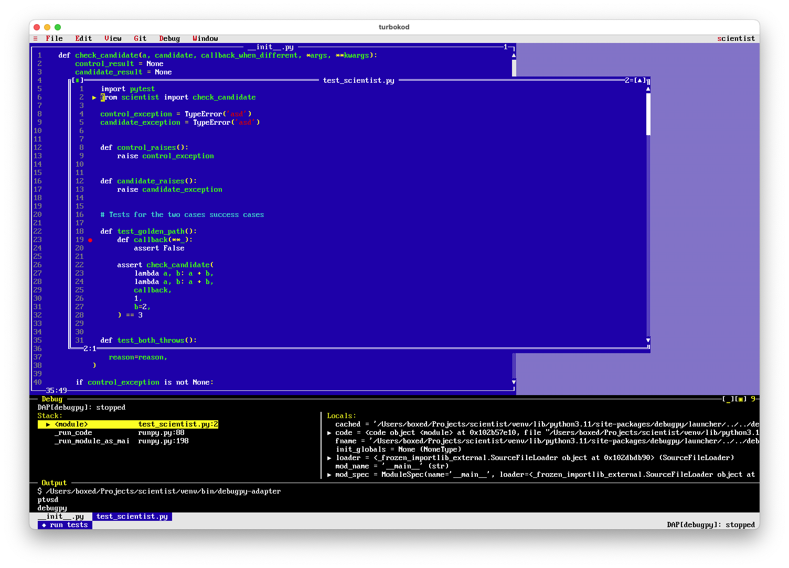

# Turbokod

A port of [Turbo Vision](https://en.wikipedia.org/wiki/Turbo_Vision) to [Mojo](https://www.modular.com/mojo) — and a working code editor / IDE built on top of it. Based on the modern C++ reference implementation [`magiblot/tvision`](https://github.com/magiblot/tvision).



The project has two layers:

1. **A TUI toolkit** in the spirit of Turbo Vision: cell-based double-buffered canvas, raw-mode terminal driver, tagged-union events, a `Drawable` trait with widgets, windows, menus, dialogs, scroll bars, dropdowns, status bar, and a desktop window manager.
2. **A code editor / IDE** built on top of that toolkit: multi-cursor editor, syntax highlighting via TextMate grammars, LSP and DAP integrations, spell checking, project-wide find/replace, file tree, git blame and gutter, run/debug targets, editorconfig support, undo/redo, soft wrap, minimap, tab bar.

The editor runs in any terminal, but ships with an optional native macOS `.app` wrapper (Rust + `alacritty_terminal` + `winit` + `softbuffer` + `fontdue`) that gives it a real window, system clipboard, font fallback for emoji/CJK, dock icon, and `turbokod://` URL handling — so files and projects can be opened from the Finder, `open -a turbokod ...`, or other apps.

## Status

Usable as a daily editor for Mojo, Python, Rust, Go, TypeScript/JavaScript, JSON, C/C++, Shell, SQL, HTML, CSS — anything with a bundled TextMate grammar. The scope covered by the toolkit alone (windows, menus, dialogs, mouse, paste, focus) is enough to ship non-editor TUI apps too; the editor just happens to be the most demanding consumer.

What's not yet there: Windows console backend, full grapheme-cluster width handling, truecolor (the `Attr` layout is ready), a few of the heavier vscode TextMate features (injections in particular).

## Quickstart

```sh
./run.sh examples/desktop.mojo            # the editor / IDE demo
./run.sh examples/desktop.mojo path/...   # ...opening file(s) or a project dir
./run.sh examples/hello.mojo              # minimal windowed greeting
./run.sh examples/boxes.mojo              # arrow-key-driven draggable frame
./run.sh tests/test_basic.mojo            # pure-data tests, no TTY needed
```

If you use [pixi](https://pixi.sh):

```sh
pixi run desktop
pixi run hello
pixi run test
```

`run.sh` does `mojo build -I src ...` (not `mojo run`) and execs the resulting native binary, caching it under `.build/` keyed by entry-point path. We build instead of JIT-running because `mojo run` silently ignores `-Xlinker`, and the editor links against `libonig` (for TextMate grammar regexes). First build is ~8–12 s; cached re-runs are essentially free.

### macOS app bundle

To build the native wrapper and register it with LaunchServices:

```sh
make build
```

This wraps `./build.sh`, which builds the Mojo backend, the Rust frontend, assembles `app/target/release/turbokod.app` around them, bundles `libonig.dylib`, ad-hoc-signs the bundle, and re-registers it via `lsregister -f` (so `Info.plist` changes take effect immediately — without that step macOS keeps using the cached registration). After that:

```sh
open -a turbokod /path/to/project
open -a turbokod /path/to/file.py
open 'turbokod://open?file=/abs/path/to/run.sh&line=10'
```

## Layout

```
turbokod/
├── src/turbokod/                # the Mojo port + editor (the actual product)
│   ├── geometry / colors / cell / canvas / events / terminal
│   │                             # the toolkit core
│   ├── view / window / desktop  # widgets, window manager, desktop / menubar
│   ├── menu / dropdown / prompt / status / tab_bar / dir_browser /
│   │   file_dialog / save_as_dialog / confirm_dialog / file_tree /
│   │   text_field / buttons / painter
│   │                             # higher-level UI building blocks
│   ├── editor / clipboard / editorconfig / diff / spell / spell_menu
│   │                             # the editor proper + supporting bits
│   ├── highlight / tm_grammar / tm_tokenizer / onig / onig_shim.c
│   │   grammars/*.tmLanguage.json
│   │                             # syntax highlighting (TextMate via libonig)
│   ├── lsp / lsp_dispatch / language_config / find_symbol / symbol_pick
│   │                             # Language Server Protocol client
│   ├── dap / dap_dispatch / debug_pane / debugger_config
│   │                             # Debug Adapter Protocol client
│   ├── git_blame / git_changes / git_gutter_menu / local_changes
│   │                             # git integration
│   ├── project / project_find / project_targets / quick_open
│   │                             # multi-file project actions
│   ├── doc_config / doc_pick / doc_store / dictionary_install /
│   │   grammar_install / install_runner
│   │                             # docs / dictionary / grammar bundles
│   ├── action_editor / settings / config / session_store
│   │                             # config + session persistence
│   ├── process_shim.c            # kill-on-parent-death registry for child PIDs
│   └── data/                     # bundled language metadata (from helix)
├── examples/                     # runnable demos (desktop, hello, boxes, ...)
├── tests/                        # mojo tests + a couple of repro scripts
└── app/                          # rust front-end for the macOS .app
```

## Design choices vs. C++ Turbo Vision

The C++ codebase is a faithful update of a 1990s Borland design — single-inheritance hierarchies, packed 16-bit attribute words, the Borland RTL emulated for source compatibility, the `Uses_XXXX` preprocessor mechanism. Most of that is a means to an end (DOS, 640K, Borland C++) and would be needless complexity in Mojo. Where the port deviates:

- **Composition over inheritance.** Mojo structs don't inherit, so the deep TView → TGroup → TWindow chain becomes a `Drawable` trait + concrete widget structs. Composition is by ownership, not virtual dispatch up a class chain.
- **Tagged-union events instead of mode-flag + union.** Borland's `TEvent` packs four mutually-exclusive `evXxx` flags into a bitmask and switches on a union; we use a single `kind: UInt8` discriminant.
- **`Cell.glyph` is a `String`, not a 16-bit char.** Unicode and grapheme clusters are expressible at the cell level. Width-aware paint is partial; data layout is ready.
- **256-color attributes by default** with style bits in a separate field. No 4-bit BIOS attribute byte. Truecolor goes in by adding an enum tag to `Attr`.
- **Single-pass dataflow per frame.** Widgets paint into the back canvas → `Terminal.present` diffs against the front canvas → only changed cells are written as ANSI sequences. Same idea as `TDisplayBuffer`, expressed as plain `List[Cell]`.
- **Python interop in `terminal.mojo` only.** `termios`, `select`, `tty`, `os.read`, `os.get_terminal_size` — using Python's stdlib is cleaner than per-platform FFI shims and is a Mojo headline feature. Pure-Mojo FFI replacements can be slotted in later.
- **No `Uses_XXXX` mechanism, no Borland-RTL shim.** Mojo modules give us proper incremental compilation; imports are explicit per file.
- **Snake_case methods, no T-prefix on types.** `put_text`, `next_event`, `Point`, `Window` — not `putString`, `getEvent`, `TPoint`, `TWindow`.

See `CLAUDE.md` for the gory details of the syntax-highlighting runtime, the incremental tokenizer's caching strategy, the Mojo-version-sensitive idioms the code targets, and how the macOS app bundle is composed.

## Roadmap

Rough order of value, from the toolkit side:

1. Truecolor support in `Attr`.
2. Grapheme-cluster-aware drawing and East-Asian width handling.
3. Pure-Mojo FFI termios/poll backend (drop the Python interop on the hot path).
4. Windows console backend.
5. TextMate `injections` and a few more vscode-grammar features so currently-bundled-but-unmapped grammars (Markdown, YAML, Ruby) light up via the runtime instead of falling back to the generic per-language tokenizer.

## License

The Mojo port is MIT-licensed (see `LICENSE`). Vendored TextMate grammars under `src/turbokod/grammars/` carry their upstream MIT/Apache licenses (per `grammars/README.md`).
