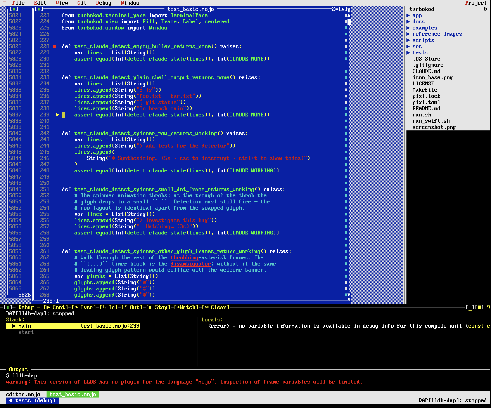

# Turbokod

A modern full featured IDE in the style of Borland Turbo C++ 3.0. Based on the modern C++ reference implementation of TurboVision [`magiblot/tvision`](https://github.com/magiblot/tvision).



The project has two layers:

1. **A TUI toolkit** in the spirit of Turbo Vision: cell-based double-buffered canvas, raw-mode terminal driver, tagged-union events, a `Drawable` trait with widgets, windows, menus, dialogs, scroll bars, dropdowns, status bar, and a desktop window manager.
2. **A code editor / IDE** built on top of that toolkit: multi-cursor editor, syntax highlighting via TextMate grammars, LSP and DAP integrations, spell checking, project-wide find/replace, file tree, git blame and gutter, run/debug targets, editorconfig support, undo/redo, soft wrap, minimap, tab bar.

The editor runs in any terminal, but ships with an optional native macOS `.app` wrapper (Swift / AppKit front-end loading the Mojo backend as a dylib) that gives it a real window, system clipboard, font fallback for emoji/CJK, and dock icon.

## Themes

| Dracula | Solarized Light |
|---|---|
|  |  |

[docs/themes.md](docs/themes.md) for the full list.


## Quickstart

```sh
./run.sh examples/desktop.mojo            # the editor / IDE demo
./run.sh examples/desktop.mojo path/...   # ...opening file(s) or a project dir
./run.sh examples/hello.mojo              # minimal windowed greeting
./run.sh examples/boxes.mojo              # arrow-key-driven draggable frame
./run.sh tests/test_basic.mojo            # pure-data tests, no TTY needed
```

If you use [pixi](https://pixi.sh):

```sh
pixi run desktop
pixi run hello
pixi run test
```

`run.sh` does `mojo build -I src ...` (not `mojo run`) and execs the resulting native binary, caching it under `.build/` keyed by entry-point path. We build instead of JIT-running because `mojo run` silently ignores `-Xlinker`, and the editor links against `libonig` (for TextMate grammar regexes). First build is ~8–12 s; cached re-runs are essentially free.

### macOS app bundle

To build the native wrapper:

```sh
./run_swift.sh                    # restore last session
./run_swift.sh /path/to/project   # open a project
./run_swift.sh path/to/file.py    # open a file
```

`run_swift.sh` builds the Rust shim staticlib (`app/turbokod-shim`), the Mojo dylib (`src/turbokod/native_api.mojo` → `.build/libturbokod.dylib`), and the Swift binary (`app/swift/TurboKod.swift` → `.build/turbokod_swift`), then assembles them into `.build/TurboKod.app` and execs it. Swift owns the AppKit run loop / windows / menus / Core Text rendering; the Mojo dylib is the Desktop model.

## License

The Mojo port is MIT-licensed (see `LICENSE`). Vendored TextMate grammars under `src/turbokod/grammars/` carry their upstream MIT/Apache licenses (per `grammars/README.md`). The porting from the C++ TurboVision port was done with Claude Code, with that codebase also under MIT license.
