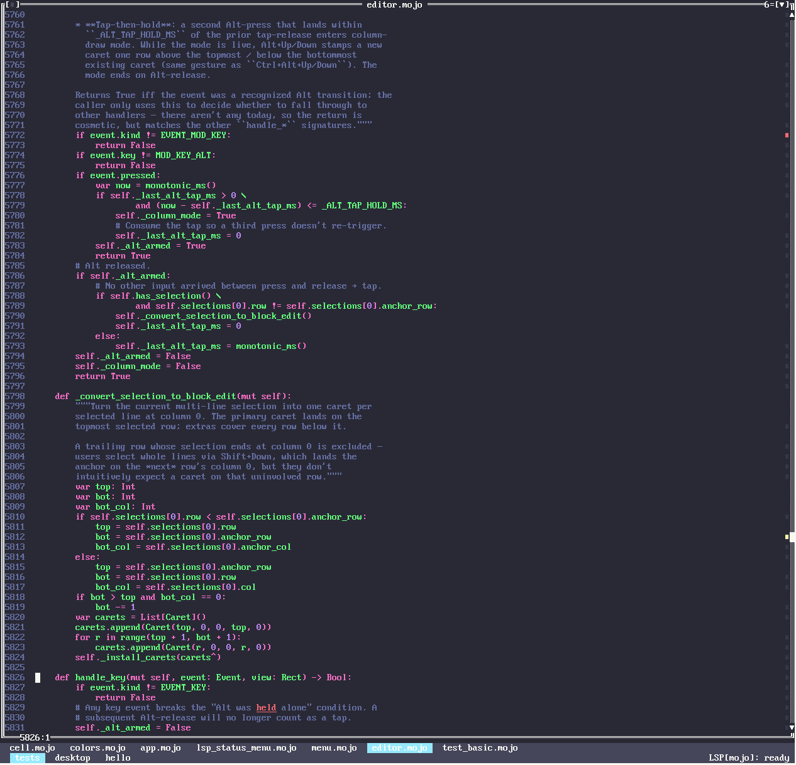
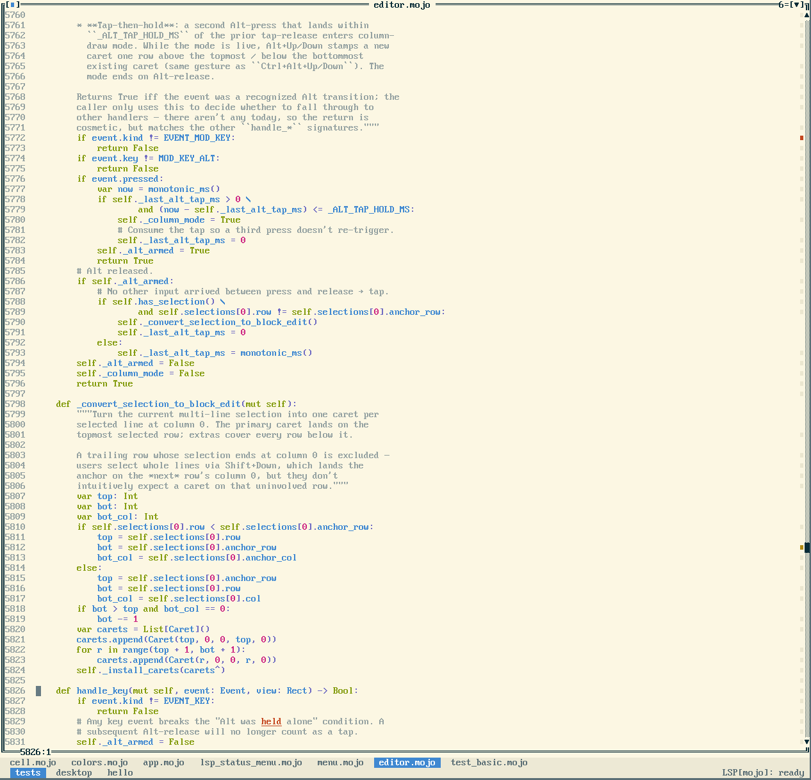

# Color themes

TurboKod ships a set of color themes that retint **both** syntax highlighting
**and** the UI chrome (menus, window frames, dialogs, desktop background, tool
panels). The default is **Turbo C++ 3.0** — the classic blue Turbo Vision look,
pixel-identical to how the app rendered before themes existed. Pick another from
**Settings ▸ Theme**; the change applies live (the whole UI retints as you arrow
through the list) and persists to `~/.config/turbokod/config.json`.

To make the live preview useful, Settings doesn't cover the workspace: on macOS
it opens in its **own native window** (same second-surface pattern as the
floating panels — `Desktop.settings_detached`, `tk_desktop_layout_settings` /
`tk_desktop_settings_*`, polled via `tk_desktop_settings_active`), leaving the
project window fully interactive; in the terminal it's a centered **floating
dialog** you can move (drag the title row) and resize (drag the left/right/
bottom border), with the editor visible around it.

Bundled themes: Turbo C++ 3.0, Monokai, Dracula, One Dark, Gruvbox Dark,
Solarized Dark, Solarized Light, GitHub Light, One Light, Turbo Pascal 7,
Norton Commander, QBasic.

| Turbo C++ 3.0 (default) | Monokai | Dracula |
|---|---|---|
|  |  |  |

| One Dark | Gruvbox Dark | Solarized Dark |
|---|---|---|
|  |  |  |

| Solarized Light | GitHub Light | One Light |
|---|---|---|
|  |  |  |

| Turbo Pascal 7 | Norton Commander | QBasic |
|---|---|---|
|  |  |  |

> Regenerate these with `make screenshots` (needs a real display — see below).

## How it works

A theme is **just a 256-entry RGB palette** (`theme.mojo`). Every widget paints
through *palette indices* — the named color constants in `colors.mojo` — and
both frontends resolve indices to RGB only at the very edge:

- **Native macOS**: the Swift host holds a `palette` table and refetches it via
  the `tk_theme_palette` / `tk_theme_version` C ABI whenever the active theme
  changes (`TurboKod.swift`).
- **Terminal**: on truecolor-capable terminals (`terminal_supports_truecolor`)
  the renderer emits 24-bit `38;2;r;g;b` SGR resolved through the palette
  (`attr_to_sgr_rgb`), so the theme looks the same as in the native app rather
  than deferring to the user's terminal color scheme. Non-truecolor terminals
  fall back to indexed `38;5;N` (the theme then only fully applies natively).

Because everything already routes through indices, swapping the palette retints
the *entire* UI with no change to the ~450 `Attr(...)` paint sites. Index layout:

- `0..15` — the ANSI-16 palette, drives all chrome. Slot roles are fixed by the
  paint code (`7` = chrome surface, `0` = text on it, `15` = bright/border, `2`
  = selection, `6` = list bodies, `1` = menu hotkey, `8` = dim/line numbers).
  Dark themes set slot `0` light and slot `7` dark; light themes do the reverse.
- `16..24` — reserved editor/syntax slots (`EDITOR_BG`, `EDITOR_FG`, then the
  seven token roles keyword/string/comment/number/ident/decorator/operator),
  **decoupled from chrome** so token hues match the theme regardless of menu
  colors.
- `25..26` — `PANE_BG` / `PANE_FG`: the dark terminal-like surface used by the
  tool panels and window drop-shadows, kept dark in every theme.
- `27..28` — `CARET_FG` / `CARET_BG`: the editor caret block, set per theme to
  its published cursor color so the caret always contrasts with the editor
  surface (the default keeps the classic yellow block).
- `29` — `BORDER_FOCUS`: focused window-border line color — borders share the
  window content's background, so this is near-white on dark editors and a
  strong dark on light ones (unfocused borders use `EDITOR_FG`).
- everything else keeps the standard xterm 6×6×6 cube + grayscale ramp.

Switching theme is a pure palette swap + repaint. Highlights bake the *stable*
reserved indices at tokenize time, so the index→RGB mapping is all that changes
— **no re-tokenize** is needed.

## Adding a theme

In `theme.mojo`, add a row to `built_in_themes()`: `THEME_SLOT_COUNT` RGB values —
ANSI `0..15`, then `EDITOR_BG, EDITOR_FG, SYN_KEYWORD, SYN_STRING, SYN_COMMENT,
SYN_NUMBER, SYN_IDENT, SYN_DECORATOR, SYN_OPERATOR, PANE_BG, PANE_FG, CARET_FG,
CARET_BG, BORDER_FOCUS`. The name appears in
Settings ▸ Theme automatically. For a dark theme make slot `0` (text) light and
slot `7` (surface) dark; keep `PANE_BG` dark. That's the whole change — both
frontends pick it up.

## Capturing screenshots

`make screenshots` (= `scripts/screenshots.sh [out-dir]`) opens the app once
per theme and writes a PNG for each into `docs/screenshots/`, then stages a
debug session paused at a breakpoint in the repo's own test suite and grabs
the README hero shot (`screenshot.png`). It's driven entirely by env knobs
the app honors when `TK_CAPTURE` is set (see "scripted screenshot capture"
in `app/swift/TurboKod.swift`):

- `TK_CAPTURE=<path>` — render one frame to `<path>` then quit
  (`TK_CAPTURE_DELAY` controls the settle delay).
- `TK_THEME=<name>` — override the active theme for this process only (not
  persisted). Handy on its own: `TK_THEME=Dracula ./run_swift.sh .`
- `TK_OPEN=<abs-path>:<line>` — open a file at a 1-based line, so every
  theme shot shows the same scene.
- `TK_CAPTURE_ACTIONS=<a>,<b>` — menu actions invoked in order before the
  grab, through the same dispatch path a click would take (the debugger
  shot uses `debug:toggle_bp,debug:start_or_continue`).
- `TK_CAPTURE_WHEN=debug-stopped` — hold the grab until the debugger is
  actually paused at its breakpoint (polls `tk_desktop_debug_stopped`;
  `TK_CAPTURE_TIMEOUT` caps the wait, default 30 s).

While `TK_CAPTURE` is set the tool panels stay docked even if the saved
layout floats them, so the staged debug pane is in the captured window.

GUI capture needs a real display, so run it on a Mac desktop session — not
headless or over SSH, where the grab comes out blank. The debugger shot
additionally needs `lldb-dap` on `$PATH` (ships with Xcode 15+).
